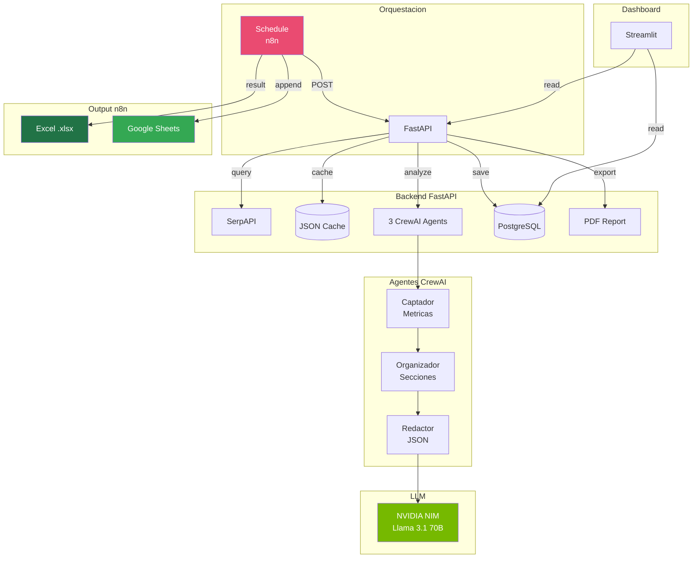

<div align="center">
  
  <picture>
    <source media="(prefers-color-scheme: dark)" srcset="https://raw.githubusercontent.com/AndresF-GaleanoT/pricepulse-ai/main/assets/logo-dark.svg">
    
  </picture>

  <h1>PricePulse AI</h1>

  <p><b>Monitoreo inteligente de precios en e-commerce</b><br/>
  <i>3 agentes IA + NVIDIA NIM + n8n + Google Sheets · 100% open source</i></p>

  <p>
    <a href="https://github.com/AndresF-GaleanoT/pricepulse-ai/pulse"></a>
    <a href="https://github.com/AndresF-GaleanoT/pricepulse-ai/stargazers"></a>
    <a href="https://github.com/AndresF-GaleanoT/pricepulse-ai/network"></a>
    <a href="https://github.com/AndresF-GaleanoT/pricepulse-ai/issues"></a>
    <a href="https://opensource.org/licenses/MIT"></a>
  </p>

  <div>
    <a href="#-caracteristicas">Caracteristicas</a> ·
    <a href="https://pricepulse-ai.onrender.com/docs">Demo API</a> ·
    <a href="https://polished-invite-ward-heritage.trycloudflare.com">n8n Dashboard</a> ·
    <a href="#-roadmap">Roadmap</a> ·
    <a href="#-contribuir">Contribuir</a>
  </div>

  <br/>

  
  
  
  
  
  
  
  

</div>

---

## 📖 Por que PricePulse AI?

Cada hora, miles de productos cambian de precio en e-commerce. Hacer seguimiento manual es imposible. **PricePulse AI** automatiza todo:

1. **Busca** precios reales en Google Shopping + Amazon via SerpAPI
2. **Analiza** con 3 agentes IA (Captador + Organizador + Redactor) usando NVIDIA NIM
3. **Guarda** en Google Sheets y Excel (via n8n)
4. **Reporta** anomalias, tendencias y recomendaciones de compra

---

## ✨ Caracteristicas

<div align="center">

| | | |
|:---:|:---:|:---:|
| 🧠 **3 Agentes IA**<br/>Captador, Organizador, Redactor | ⚡ **NVIDIA NIM**<br/>Llama 3.1 70B en GPU | 🛒 **3 fuentes**<br/>Amazon + eBay + Mercado Libre |
| 📊 **Auto-export**<br/>Excel + Google Sheets | 🔄 **n8n scheduler**<br/>0, 8, 16h automatico | 💾 **PostgreSQL**<br/>Historico completo |
| 🚀 **FastAPI async**<br/>Respuesta < 3s sin IA | 🐳 **Docker Compose**<br/>1 comando = todo | 📱 **Dashboard**<br/>Streamlit + metricas |
| 🔐 **Cloudflare Tunnel**<br/>HTTPS publico | 💰 **Costo $0**<br/>Todo en tier gratuito | 📄 **PDF export**<br/>Reportes ejecutivos |

</div>

---

## 🎯 Demo rapida

```bash
# 1. Clonar e instalar
git clone https://github.com/AndresF-GaleanoT/pricepulse-ai.git
cd pricepulse-ai

# 2. Configurar API keys
cp .env.example .env
nano .env   # Agregar NVIDIA_API_KEY y SERPAPI_KEY

# 3. Levantar todo
docker compose up -d --build
```

```bash
# 4. Probar el endpoint
curl -X POST http://localhost:8000/analizar-precios \
  -H "Content-Type: application/json" \
  -d '{"producto": "RTX 5090", "plataformas": ["amazon","newegg","bestbuy"]}' \
  | jq '.filas'
```

Salida tipica:

```json
[
  {"fecha":"2026-07-30T03:00:00","producto":"RTX 5090","plataforma":"Amazon","titulo":"NVIDIA RTX 5090 Founders Edition","precio":1999.0,"link":"https://amazon.com/dp/..."},
  {"fecha":"2026-07-30T03:00:00","producto":"RTX 5090","plataforma":"Newegg","titulo":"GIGABYTE RTX 5090 Gaming OC","precio":2049.99,"link":"https://newegg.com/..."},
  {"fecha":"2026-07-30T03:00:00","producto":"RTX 5090","plataforma":"Best Buy","titulo":"MSI RTX 5090 Suprim","precio":2109.99,"link":"https://bestbuy.com/..."},
  {"fecha":"2026-07-30T03:00:00","producto":"RESUMEN: RTX 5090","plataforma":"Amazon","titulo":"Mejor precio en Amazon","precio":1999.0,"link":"Diferencia de $110 vs Best Buy"}
]
```

---

## 🧠 Arquitectura

<div align="center">



</div>

### Flujo de datos

```
[SerpAPI] ──► [Cache] ──► [CrewAI Agents]
                              │
            ┌─────────────────┼─────────────────┐
            ▼                 ▼                 ▼
      [Captador]       [Organizador]      [Redactor]
      (metricas)       (secciones)        (JSON final)
            │
            ▼
    ┌──────────────┐
    │  Respuesta   │
    │  + filas[]   │
    └──────┬───────┘
           │
    ┌──────▼──────┐
    │   n8n      │
    │  Code node │
    │  (extract) │
    └──────┬──────┘
           │
    ┌──────┴──────┐
    │             │
    ▼             ▼
 [Excel]    [Google Sheets]
```

---

## 🛠 Stack Tecnologico

| Componente | Tecnologia | Version |
|------------|-----------|---------|
| **API** | FastAPI (async, auto-docs) | 0.115+ |
| **Agentes IA** | CrewAI (3 agentes secuenciales) | 3.0+ |
| **LLM** | NVIDIA NIM - Llama 3.1 70B Instruct | - |
| **Precios** | SerpAPI (Amazon + eBay + Mercado Libre) | - |
| **Orquestador** | n8n (self-hosted) | 1.80+ |
| **Base de datos** | PostgreSQL 16 Alpine | 16 |
| **Cache** | JSON files (TTL configurable) | - |
| **PDF** | FPDF2 | 2.8+ |
| **Dashboard** | Streamlit | 1.0+ (via Docker) |
| **Container** | Docker Compose | 3.8+ |
| **HTTPS** | Cloudflare Tunnel | - |

---

## 🚀 Instalacion

### Prerequisitos

- Docker & Docker Compose
- Python 3.11+ (solo para dev local)
- API keys: [NVIDIA NIM](https://build.nvidia.com/) + [SerpAPI](https://serpapi.com/)

### Opcion 1: Docker (recomendado)

```bash
git clone https://github.com/AndresF-GaleanoT/pricepulse-ai.git
cd pricepulse-ai
cp .env.example .env

# Editar .env con tus claves (NVIDIA_API_KEY, SERPAPI_KEY)
nano .env

# Levantar servicios
docker compose up -d --build
```

| Servicio | URL | Acceso |
|----------|-----|--------|
| **API** | http://localhost:8000 | Publica via tunnel |
| **Swagger** | http://localhost:8000/docs | Documentacion |
| **n8n** | http://localhost:5678 | admin / (tu password) |
| **PostgreSQL** | localhost:5432 | Solo interno |

### Opcion 2: Local (dev)

```bash
git clone https://github.com/AndresF-GaleanoT/pricepulse-ai.git
cd pricepulse-ai
python -m venv venv && source venv/bin/activate
pip install -r requirements.txt
cp .env.example .env
python main.py
# Servidor en http://localhost:8000
```

---

## 🔧 Variables de Entorno

```env
# === NVIDIA NIM (LLM) ===
NVIDIA_API_KEY=nvapi-...
NVIDIA_BASE_URL=https://integrate.api.nvidia.com/v1
MODEL_NAME=openai/meta/llama-3.1-70b-instruct

# === SerpAPI (precios) ===
SERPAPI_KEY=...

# === PostgreSQL ===
DATABASE_URL=postgresql://precios:precios2024@db:5432/pricepulse

# === Cache ===
CACHE_TTL_HOURS=4
CACHE_DIR=cache

# === API URL (n8n lo usa internamente) ===
API_URL=http://localhost:8000

# === Puerto ===
PORT=8000

# === n8n (se setean en docker-compose) ===
N8N_BASIC_AUTH_USER=admin
N8N_BASIC_AUTH_PASSWORD=tu-password-seguro
N8N_WEBHOOK_URL=https://tu-tunnel.trycloudflare.com
# Nota: N8N_WEBHOOK_URL en docker-compose usa N8N_WEBHOOK_URL del .env
```

---

## 📋 API

### `POST /analizar-precios`

Obtiene precios reales + analisis IA completo.

**Request:**
```json
{
  "producto": "NVIDIA Jetson Orin Super",
  "plataformas": ["amazon", "newegg", "robotshop"]
}
```

**Response:**
```json
{
  "status": "success",
  "producto": "NVIDIA Jetson Orin Super",
  "precios_encontrados": [
    {
      "plataforma": "Amazon",
      "titulo": "NVIDIA Jetson Orin Nano Super Developer Kit",
      "precio": 384.9,
      "link": "https://www.amazon.com/dp/B0BZJTQ5YP/"
    }
  ],
  "reporte_ia": "Analisis completo del Captador, Organizador y Redactor...",
  "resumen": {
    "precio_minimo": 267.99,
    "precio_maximo": 458.0,
    "precio_promedio": 362.99,
    "mejor_plataforma": "Amazon",
    "total_ofertas": 12,
    "veredicto": "oferta",
    "explicacion": "Precio 22% menor al promedio en Amazon",
    "recomendacion": "comprar"
  },
  "filas": [
    {
      "fecha": "2026-07-30T03:00:00",
      "producto": "NVIDIA Jetson Orin Super",
      "plataforma": "Amazon",
      "titulo": "NVIDIA Jetson Orin Nano Super Developer Kit",
      "precio": 384.9,
      "link": "https://www.amazon.com/dp/B0BZJTQ5YP/"
    }
  ]
}
```

### `GET /health`
```json
{"status": "ok", "version": "3.0"}
```

### `GET /historial?producto=NVIDIA&limit=50`
Historial completo de analisis desde PostgreSQL.

### `GET /exportar-pdf?producto=NVIDIA Jetson`
Descarga reporte PDF.

---

## 🤖 n8n Workflow

El archivo `n8n_workflow_excel.json` contiene el workflow completo:

| Nodo | Funcion |
|------|---------|
| **Schedule Trigger** | Ejecuta a las 00:00, 08:00, 16:00 UTC |
| **Set (Configurar Variables)** | Define `API_URL=http://api:8000` |
| **HTTP Request** | POST a `/analizar-precios` (timeout 600s) |
| **Code (Extraer Filas)** | Mapea `response.filas` a 6 columnas |
| **Google Sheets** | Append a hoja con columnas: fecha, producto, plataforma, titulo, precio, link |
| **Spreadsheet File** | Convierte a Excel .xlsx |

**Importar:** n8n UI → Workflows → Add From File → seleccionar `n8n_workflow_excel.json`

**Columnas en Google Sheets:**

| A | B | C | D | E | F |
|---|---|---|---|---|---|
| fecha | producto | plataforma | titulo | precio | link |

---

## 📊 Dashboard

```bash
# Opcion 1: Local (recomendado)
pip install -r requirements.txt
API_URL=http://localhost:8000 streamlit run dashboard.py --server.port 8501

# Opcion 2: Via Docker (usa Python 3.11 del contenedor API)
docker compose exec -e API_URL=http://localhost:8000 api streamlit run dashboard.py --server.port 8501 --server.address 0.0.0.0
```

Visualiza:
- Precios actuales vs historicos
- Graficos de tendencia por producto
- Tabla comparativa por plataforma
- Filtros por producto, plataforma y rango de fechas
- Sin dependencia externa (lee de la API, no de Google Sheets)

---

## 🌐 Exponer con Cloudflare Tunnel

```bash
# Tunnel para n8n
cloudflared tunnel --url http://localhost:5678

# Tunnel para la API (como systemd service)
sudo cp cloudflared-api.service /etc/systemd/system/
sudo systemctl daemon-reload
sudo systemctl enable --now cloudflared-api

# Verificar
curl -s https://tu-tunnel.trycloudflare.com/health
```

---

## 📈 Roadmap

### ✅ Completado
- [x] Cache inteligente para SerpAPI (TTL 4h)
- [x] Historial en PostgreSQL
- [x] Exportar PDF con FPDF2
- [x] Docker Compose (API + n8n + PostgreSQL)
- [x] Dashboard Streamlit
- [x] 3 agentes CrewAI (captador, organizador, redactor)
- [x] Exportar Excel (.xlsx) via n8n
- [x] Google Sheets como backup automatico
- [x] Cloudflare tunnel para HTTPS
- [x] Respuesta JSON estructurada (`filas`) para hojas de calculo
- [x] Busqueda en Amazon + eBay + Mercado Libre
- [x] Dashboard sin dependencia externa (lee de API)

### 🔜 Proximos
- [ ] Alertas Telegram (precio bajo detectado)
- [ ] Prediccion de tendencias con ML
- [ ] Autenticacion JWT
- [ ] Tests automatizados (pytest)
- [ ] Multi-idioma (prompts en ingles/espanol)
- [ ] Soporte para mas e-commerce (eBay, AliExpress)
- [ ] Web scraping directo como fallback
- [ ] Modo oscuro en dashboard

---

## 💰 Costo Operativo

| Servicio | Plan | Costo |
|----------|------|-------|
| NVIDIA NIM | Gratuito | 1000 credits/mes |
| SerpAPI | Gratuito | 100 busquedas/mes |
| PostgreSQL | Self-hosted | $0 |
| n8n | Self-hosted | $0 |
| Cloudflare Tunnel | Gratuito | $0 |
| **Total** | | **$0/mes** |

---

## 🤝 Contribuir

¡Las contribuciones son bienvenidas!

1. Fork el repo
2. Crea tu rama: `git checkout -b feature/mi-feature`
3. Commit: `git commit -m "feat: agregar X"`
4. Push: `git push origin feature/mi-feature`
5. Abre un Pull Request

### Lineamientos
- Usar Python 3.11+ type hints
- Async/await para operaciones I/O
- Seguir el patron de 3 agentes CrewAI
- Agregar tests cuando sea posible

---

## 📄 Licencia

Distribuido bajo **MIT License**. Ver [LICENSE](LICENSE) para mas informacion.

---

## 👥 Autores

- **Andres F. Galeano T.** - [@AndresF-GaleanoT](https://github.com/AndresF-GaleanoT)

<div align="center">

---

### ⭐ Si este proyecto te sirve, dale una estrella!

*Hecho con Python, NVIDIA NIM, CrewAI y mucho cafe* ☕

[](https://github.com/AndresF-GaleanoT/pricepulse-ai/stargazers)

</div>
